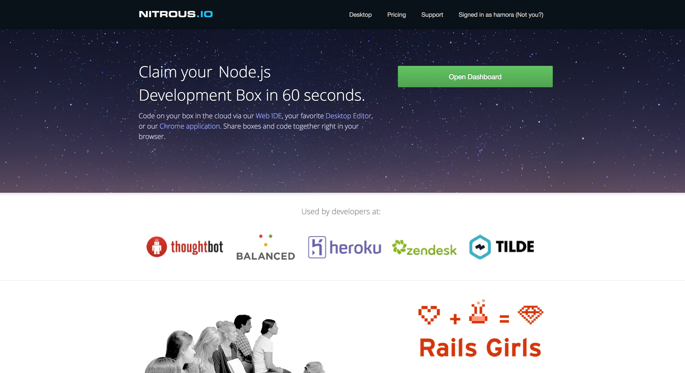

**WDI Fundamentals**

# Setting Up Your Nitrous Box

We're going to be writing quite a few programs throughout this course. Instead
of writing programs into files on our computer, and running these programs on
our computer, we're going to make use of a service called [Nitrous](http://nitrous.io).

Nitrous is a service that will create a computer for us in "the cloud" (yes, THE
cloud) that is all set up to run Ruby programs for us! "Well," you may ask, "if
this computer is in 'the cloud', how do we use it? How do we interact with it?"
It turns out that Nitrous also allows you to use this computer through their
website! Using a command line (more on this later) and a text editor, we will
be able to use this computer almost as if it were our own. You may not be able
to play Command and Conquer on this computer, but you sure can write and run
some Ruby programs.

Nitrous likes to call the computers they create for you "boxes". Follow these
steps to set up a Nitrous box for your work during this course.

Create an account on the [Nitrous website](http://nitrous.io)

Visit your dashboard (Click "Open Dashboard")

You should be taken to a screen where you can create a new box.

* Select the "Ruby/Rails" template
* Give your box a name
* Select a region closest to you
* Leave the "Download a GitHub repo" field blank
* Click "Create Box"

Your box should now be processing. After a short while, it will be `running`, as
shown below.

Go ahead and click Next once your box is running.

You should now be taken to your "box"'s IDE, or Integrated Development
Environment.

In essence, this is the environment that we'll be using to interact
with this computer. This screen features a text editor (think Notepad, TextEdit,
Sublime Text), a command line interface (more on this soon) and a chat window if
you have collaborators on this machine. These are the tools that we will use to
create files, write programs, and run programs.

Once you've got your Nitrous box set up, you're ready to start tackling this
course!

When you quit your Nitrous IDE and want to revisit it, log into Nitrous with
your account and open your Dashboard. You should see a list of your boxes.

Click your box to expand some options.

Clicking `IDE` will take you back to your familiar development environment.
Happy coding!
