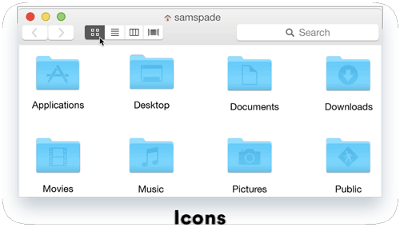
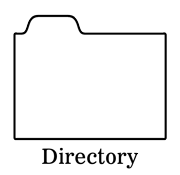
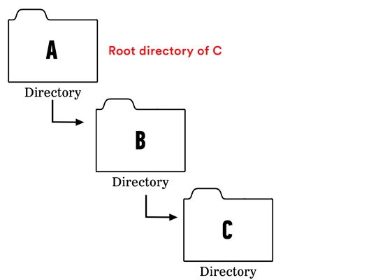

**WDI Fundamentals Unit 1**

---

##How Your Computer is Organized

Before we tell the computer what to do, it's important we understand what it is we will be manipulating. You're probably used to seeing a graphical representation of files and folders as icons in a list or in columns.

The way your computer organizes and stores files is called a **file system**. Let's take a minute to learn the vocabulary developers use to talk about it.

* In programming-speak, all folders are called **directories**.

* A directory within another directory is called a **subdirectory**.

* A directory that contains a subdirectory or file is called a **parent directory**.

* The topmost directory of the filesystem is called the **root directory** – nothing contains it. All files and directories are contained by it, and so they all share the same root.

For the purposes of this lesson, the root directory of everything on your computer is your home directory. It's aptly represented in the GUI by a house icon (if you're using a Mac).

---

We know how file and directories appear in the GUI –now let's find our way around this system on the command line.

Before we get started, it's important to point out that, as smart as they seem, computers are really dumb. To ask for a specific directory or file in command line, we need to write out a precise address (called a **path**) so that the computer knows exactly where to find it.

For example, if you Google directions to "Main Street," without any additional information, Google wouldn't know which of the 10,466-plus Main Streets you want. It might venture a guess, but your command line isn't as smart.

We have to be more specific when interacting with our computer on the command line.

Your computer understands two kinds of addresses or paths, absolute and relative.

* An absolute path starts from the root. It's analogous to identifying a location on earth by latitude and longitude. The point on earth represented by (0, 0) is somewhere out in the middle of the Atlantic ocean. No one really cares about it, but it never changes. It is "the root" from which we describe all the rest of the locations on earth. If someone gave you the coordinates for a street in Paris, you could theoretically start at (0, 0) and make your way north and east until you get there. **In this case you are defining where you're going from the root (a standard reference point), so you're using an absolute path.**

* On the other hand, if you were standing on a street corner in Anchorage, Alaska and wanted to head to the library, you wouldn't need the latitude and longitude. You could just jump in a taxi and say "Please head back two blocks, cut over to 3rd, and then turn right on Main Street." **In this case, you're defining where you're going based on your current location, so you're using a relative path.**

>**Caution** It's important to know where you're working from so that you know whether to communicate with your computer using absolute or relative paths.

---

Feeling good? [Let's do some more practice.](04_exercise.md)
