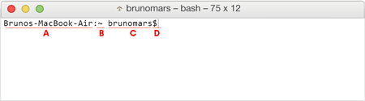

**WDI Fundamentals Unit 1**

---

Here's a quiz about Gitbook

|                  | Good | Bad |
| ---------------- | ---- | --- |
| What is Gitbook? | (x)  | ( ) |

> Gitbook is good

What does Gitbook support?
- [x] Table-based questions with radio buttons
- [x] Table-based questions with checkboxes
- [ ] Telepathy
- [x] List-based questions with checkboxes
- [x] List-based questions with radio buttons
- [ ] Moon-on-a-stick

> Gitbook supports table and list based quiz questions using either radio buttons or checkboxes.
>
> Gitbook is not telepathic and does not give you the moon on a stick.

---

---

Answer the following questions based on this image:

(B) ~ is the:

- [x] Name of the computer
- [ ] Working directory
- [ ] Username
- [ ] Parent directory

Not quite.

(B) is the working directory –it always precedes the username and reflects the users location in the file system. The "~" tilde is shorthand for the Home Directory.

(C) brunomars is the:
- [ ] Name of the computer
- [ ] Working directory
- [x] Username
- [ ] Parent directory

Not quite.

(C) is the username –it is always located right before the '$' in the first line of your command line.

(D) indicates that:*
- [ ] That the computer is unresponsive
- [ ] That the user is ready to go to lunch
- [ ] It's the equivalent of the Spinning Beach Ball of Death
- [x] That the computer is awaiting user input

Not quite.

The blinking cursor after the "$" indicates that the computer is ready to accept the user's command.  The computer will not return this prompt until it is done completing whatever task you asked of it.

---

<!--

*These quizzes can be fickle –if you do not see anything below, please try refreshing the page!
-->

[Here are more exercises to help you practice.](04_exercise.md)
