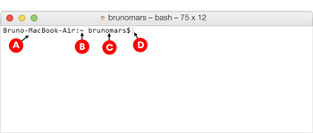

---

Answer the following questions based on this image:

(B) ~ is the:
- [ ] Name of the computer
- [x] Working directory
- [ ] Maiden name of the user's mother
- [ ] Username
- [ ] Parent directory
- [ ] Prompt

> Not quite.
> (B) is the working directory –it always preceeds the username and reflects the users location in the file system. The "~" tilde is shorthand for the Home Directory.

(C) brunomars is the:
- [ ] Name of the computer
- [ ] Working directory
- [ ] Maiden name of the user's mother
- [x] Username
- [ ] Parent directory
- [ ] Prompt

> Not quite.
> (C) is the username –it is always located right before the '$' in the first line of your command line.

(D) indicates that:
- [ ] That the computer is unresponsive
- [ ] That the user is ready to go to lunch
- [ ] It's the equivalent of the Spinning Beach Ball of Death
- [x] That the computer is awaiting user input

> Not quite.
> The blinking cursor after the "$" indicates that the computer is ready to accept the user's command.  The computer will not return this prompt until it is done completing whatever task you asked of it.

---
