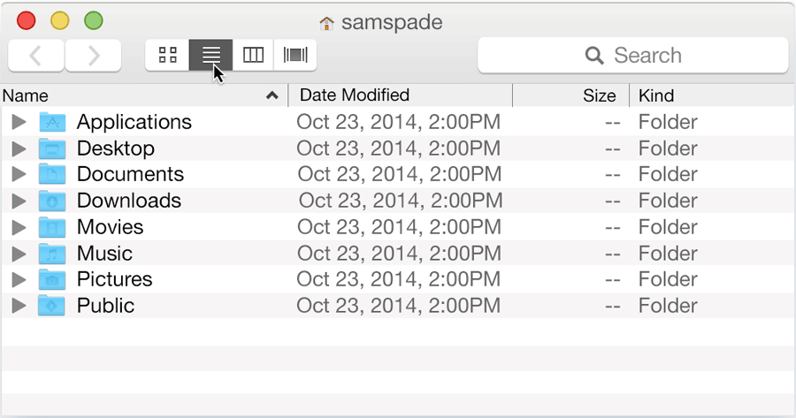

**WDI Fundamentals Unit 1**

---

## Your Turn

Go ahead an open up "Terminal" in any of the following ways.

1. Navigate to your Applications folder and double-click on Terminal.

2. Press <kbd>Command</kbd> + <kbd>Space</kbd> on your keyboard to bring up Spotlight – a tool that allows us to quickly find files and applications on our computer. Inside the search bar, type "Terminal", and select the Terminal application.

Great! Now everyone who can see over your shoulder will think you're a badass hacker.
