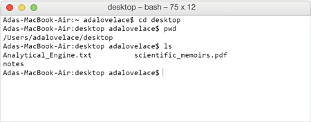

**WDI Fundamentals Unit 1**

---

Answer the following questions based on this image: 

What is the name of Ada's working directory at the end of this terminal session?

- [ ] users
- [x] desktop
- [ ] cd
- [ ] adalovelace

> Not quite.
>
> The working directory is desktop, as you can see in the prompt and the frame
> of the terminal window. The full path for desktop is
> `/Users/adalovelace/desktop/` but this question asked for its name alone.

What was Ada's working directory at the beginning of this terminal session?

- [ ] desktop
- [x] home
- [ ] cd
- [ ] adalovelace

> Not quite.
>
> The working directory was Ada's home directory, the full path for which is
> `/Users/adalovelace/`. It is represented by the `~` tilde symbol in the first
> line of this terminal session, before Ada changes her working directory to desktop.

What does the desktop of Ada's computer contain?

- [ ] `/Users/adalovelace/`
- [ ] a folder called "ls"
- [x] Analytical_Engine.txt, scientific_memoirs.pdf, and a directory called 'notes'
- [ ] Nothing, it's empty

> Not quite.
>
> As you can after Ada lists the contents of desktop (her current working
> directory), the computer returns the names of two files and a folder

---

[Here's another exercise for you](07_exercise.md) - give it a shot.
