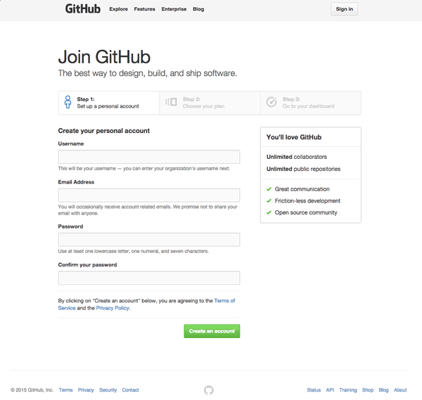
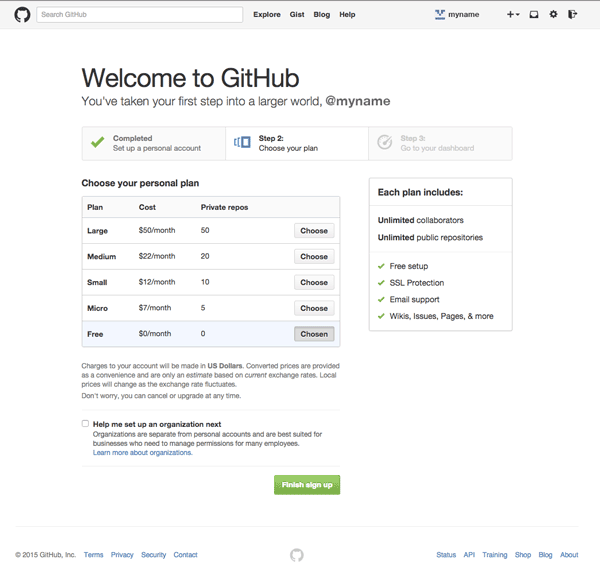

**WDI Fundamentals - Chapter 2**

---

## Your Turn

You are going to create your very own Github account!

1. Open up your browser and go to https://github.com/join.

2. Follow the 3 Steps to setting up your account:

	a. Choose a username that you'll remember and that you won't be embarrassed to share with others, and click the green "Create an Account" button:
 

	b. Select the free plan (which should be selected by default) and click the green button:

 

	c. Congratulations! You're officially a Github user, with your very own dashboard:
 

---

Now let's take a look at [our cheatsheet](08_cheatsheet.md) and look back over everything we've learned so far.

