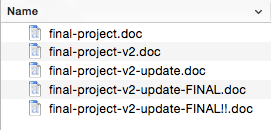

**WDI Fundamentals Unit 2**

---

#####By the end of this Unit, you'll be able to:
* Define a version control system and it's benefits
* Describe how Git works
* Identify the Git commands used to set up a local respository and to record snapshots
* Update a remote repository with local changes to a text file, from the command line

---

#Version Control

When you’re working on something, say a painting, software or an autobiography, there comes a time when you wish you had a reset button.

You might already have a system in place to deal with this problem –maybe you save your document multiple times with different names, so that you can return to a different stage of the project.

Developers call this process a “version control system”.

If you're making copies of a file every time you make a change, your file system might look like this:

 

 

While this method works, it is impossible to see
what has changed in each version without opening each file and comparing changes line by line.

Organizing different versions of your files gets even more complicated once you start working with a team.

To solve these problems, we are going to use the popular version control system called **Git**.

Git saves a history of the changes you make for you –no need to keep multiple versions of a file on hand. Git is also an excellent tool for working collaboratively on a project, though we won't be using those features right away.

Next, you'll need to [install Git on your computer](02_exercise.md) (if you haven't already).
