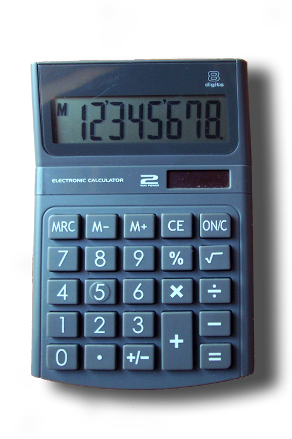
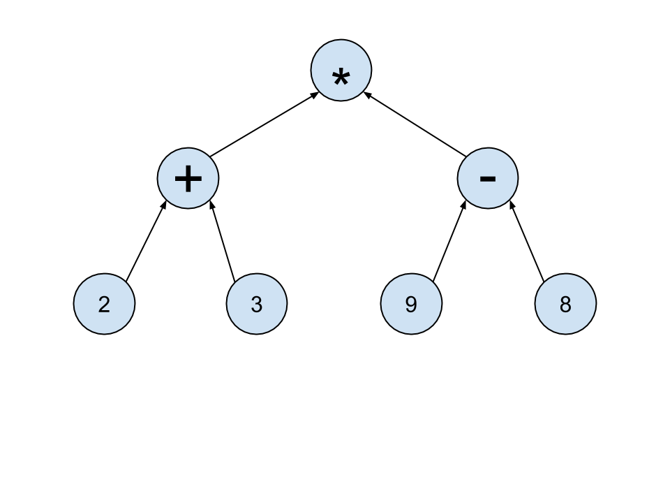
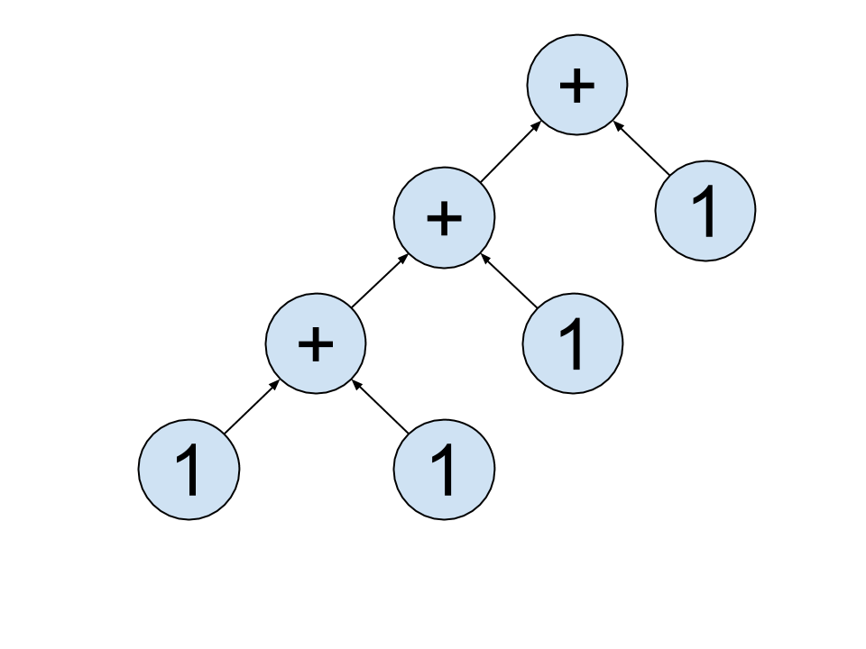

**WDI Fundamentals Unit 3**

---


# Data, Operators, and Expressions

You've probably picked up a scientific calculator at some point in the past and started playing around with it. You punch in a big number (for example, 9876435), then `x`, and then another big number (say, 373848221), hit the `=` button, and the calculator spits back a result (in this case, 3692287654572135).



That thing that we type into the calculator is called an **expression**: a collection of values (*12345*) and operations (like **+** or **x**).

The process of reducing this expression down to a single value, or *result*, is called **evaluation**.

The repl.it console is similar in many ways to this calculator. It accepts an expression (in JavaScript) from the user and attempts to evaluate that expression, yielding a single value.

Before we tackle fully-fledged JavaScript expressions, let's first look at their two components: data and operators.

<br>

## Data (a.k.a. Values)
Calculators can only operate on numbers, but computers can perform calculations on many different kinds of data, including:

* **Numbers**: Pretty self-explanatory. Some languages draw a distinction between Integers (whole numbers) and Floating Point numbers (decimals), but in JavaScript they're considered the same. <br>
<u>Examples</u>: `20`, `-4.5`, `300`,`99.99`

* **Strings**: Strings are groups of characters (either letters, numbers, or special characters like punctuation, spaces, or parentheses). They come in two varieties, `'single-quote'` (also sometimes called 'string literals') and `"double-quote"`. Though there are some differences between the two, don't worry about them for now. Strings are typically used to store text for people to read. <br> <u>Examples</u>: `"hello"`, `"goodbye"`, `"moc.liamg@gmail.com"`

* **Booleans**: This one's probably a bit new for you. Boolean-type data only has two possible values, `true` and `false`.

In case you ever forget what type of data you're dealing with, you can run the `typeof` command. Try typing the following lines into repl.it - what responses do you get?
* `typeof "hello";`
* `typeof 24;`
* `typeof 3.45;`
* `typeof true;`

> **HINT**  You may have noticed that each of those lines ended in a `;` - in JavaScript, a semicolon is used to denote the end of a line. Although your code may execute without them, there are cases where not having an semicolon at the end of a line can cause unexpected results. Just use 'em.

### Test Yourself
Try to predict the types of each of the following bits of data. Check your answers with `typeof` - were you correct?
* `24`
* `"99"`
* `'true'`
* `false`


## Operators
Of course, simply having data sitting around isn't very useful. Operators take values as their inputs (also known as **arguments**) and produce new data as output. There are *many* different operators out there, but here are some of the common ones:

* **Arithmetic** (`+`,`-`,`*`,`/`): These all work like you'd expect. In the expression `2 + 2`, the `+` operator takes both `2`s as inputs, and causes that whole expression to evaluate to `4`.

>**Note** When given String arguments, the `+` operator actually behaves differently - it 'concatenates' two strings together to make one big string.
<br><u>For example</u>: `"Hello" + " " + "Bob"` will evaluate to `"Hello Bob"`.

* **Modulus** (`%`): Remember remainders? For example, `5` divided by `3` equals `1`, with a remainder of `2`. The modulus operator takes in two numbers and gives you the remainder of their division.
<br><u>For example</u>: `5 % 3` will evaluate to `2`.

* **Inequality** (`>`,`<`): These operators take in two numbers as inputs, but unlike the previous operators, they give back *boolean* values.
<br><u>For example</u>: `5 > 1` will evaluate to `true`, while `10 < 5` will evaluate to `false`.

* **Equality** (`===`,`==`) : These operators will accept any two types of data as input, and (just like the Inequality operators) will also evaluate to a boolean value. The first of these is called a 'strict equality' - it will only evaluate `true` if both sides are completely identical - while the second, the 'loose equality', has a little more wiggle room.
<br><u>For example</u>:

    ```javascript
    5 === 5;
      => true

    5 === "5";
      => false

    5 == 5;
      => true

    5 == "5";
      => true
    ```

* **Logical Operators** (`!`,`||`,`&&`): These operators both take and give out boolean values.
    * NOT (`!`) will reverse the value of any boolean.
        `!true` => `false`
    * OR  (`||`) takes in two boolean arguments; if at least one is `true`, then it will evaluate to `true`, but if both are `false` it will evaluate as `false`.
    * AND (`&&`) also takes in two boolean arguments; however, it will only evaluate as `true` if both of the arguments are `true`; otherwise, it will evaluate to `false`.

### Test Yourself
Can you predict what will the results of these operations will be? Check your answers against the console in repl.it.
* `true && false;`
* `45 % 6;`
* `8 === 8.0;`
* `"Hello" + " " + "World";`

## Expressions
So, what happens when we bring several of these operators and values together?

Consider the following expression :

`(2+3)*(9-8)`

In order to perform the multiplication, we need to first know what we're multiplying – the `*` operator must wait until both of the expressions in parentheses have been evaluated before it can proceed.

We can represent this chain of dependencies using a logical structure called a `tree`.



To evaluate any point (or 'node') in the tree, you simply (1) evaluate that node's left 'child', and then (2) evaluate its right 'child'." In this case, to evaluate at the `*`, we first evaluate the `+` node, then the `-` node.

What happens is we're dealing with a more complicated expression? Say...

`((9+2)*25)-5`

Since the `-` requires ((9+2)*25) to be evaluated in order to perform the subtraction, this means that `-` will be at the top of our expression tree. Here is the full tree - first we perform the addition, then the multiplication, and then finally the subtraction.


One last tricky one: `1 + 1 + 1 + 1`. Obviously, we know that this is equal to 4. But what does the tree look like?

In this case, we actually need to look to the rules of math (and anyone interested in some in-depth reading on that subject can [check out this wikipedia page](http://en.wikipedia.org/wiki/Operator_associativity)). As it turns out, mathematical expressions are actually evaluated ***from left to right***. In other words, given the expression `10 - 5 + 2`, we interpret this as being `(10 - 5) + 2`, or `7`, rather than `10 - (5+2)`, or `3`.

Following this rule, our expression of `1 + 1 + 1 + 1` could also be written `((((1) + 1) + 1) + 1)`. Is it easier to see the tree now?



While we've covered what seems like a lot of math in this section, don't worry – you're not going to be doing calculus in this course. It's important that we review these concepts because there will be many times that you'll solve a problem by using one of these basic principles of math. When it comes down to it, computers operate on a pretty simple and straightforward logic.

---
Think you're solid on the basics of expressions? [Take this quiz, and see how you do.](03_quiz.md)
