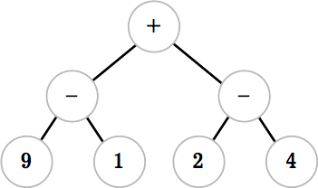
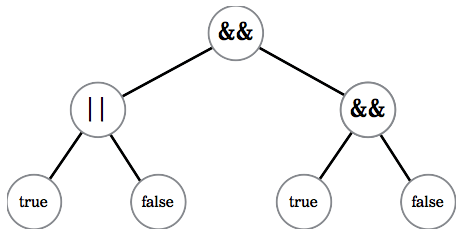

**WDI Fundamentals Unit 3**

Evaluate the following expressions:
First, try drawing expression trees for these expressions, and evaluate them by hand using the approach described earlier (left-child first, then right-child).

---
9 - 1 + 2 - 4
- [ ] 5
- [x] 6
- [ ] 10
- [ ] 2

> Not quite.
>
> 9 - 1 + 2 - 4 evaluates to 6.
> 

(30 - 5) * 2 / 5
- [x] 10
- [ ] 0
- [ ] 4
- [ ] 28

> Not quite.
>
> (30 - 5)*2/5 evaluates to 10
> 

('The ' + 'rain ') + ('in Spain ' + 'stays ') + 'mainly ' + ('in ' + 'the ') + 'plain.'
- [x] "The rain in Spain stays mainly in the plain."
- [ ] error
- [ ] "Therain inSpainstays mainly inthe plain."
- [ ] 42

> Not quite.
>
> ('The ' + 'rain ') + ('in Spain ' + 'stays ') + 'mainly ' + ('in ' + 'the ') + 'plain.' evaluates to 'The rain in Spain stays mainly in the plain.'
> 

(true || false) && (true && false)
- [x] false
- [ ] true
- [ ] 0
- [ ] true && false

> Not quite.
>
> (true || false) && (true && false) evaluates to false.
> 

---
Feeling good? [Let's do some more practice.](04_exercise.md)
