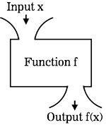

**WDI Fundamentals Unit 5**

---

#####By the end of this Unit, you'll be able to:
* Define a function with one or more parameters
* Execute a function within a program or in the console
* Given a function and a set of arguments, predict the output of a function

---

You've had an opportunity to see some functions in the homework assignments at the end of units 3 and 4; now it's time to learn about writing them!

But first... a little math.

**Function** is a term that comes out of mathematics - you may remember seeing it in a high school algebra class. The basic idea of a function is simple - it's a relationship between a set of inputs and a set of outputs.

Consider the relationship between a variable `x` and the function `f`. The function `f` takes the input `x` and spits out a single output (`f(x)`).

 

 

If we were shown the output (`f(x)`) for each value of `x`:

| x  | f(x) |
|:-: |:-:   |
| -1 | -2   |
| 0  | 0    |
| 1  | 2    |
| 2  | 4    |
| 3  | 6    |

We could figure out that the relationship between `x` and `f(x)` is that the output is equal to double the input.  In algebra, this relationship is written as `f(x) = 2 * x`. Nothing unfamiliar going on here, right?

Functions play a similar role in programming – JS Functions, like mathematical functions, perform transformations. They take input values and return an output value.

[Let's take a look.](02_lesson.md)
