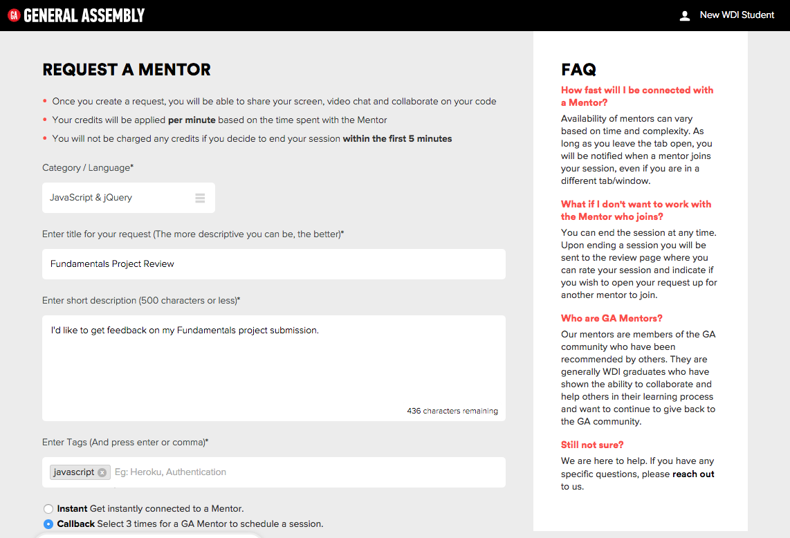

**Getting Feedback on Your Work**

---

### Introducing GA Mentors

We've invited many of our strongest graduates to provide on-demand support to you during your time in WDI through a program called GA Mentors. Starting one week before you join WDI, you'll receive 60 minutes of credits per week, which you can use to:

- ask for a code review
- get a tough concept explained
- troubleshoot a bug in your code

This is only one of the many ways we'll support you during your time in WDI, but we're really excited about being able to connect you to our awesome global community from the very beginning of your time in WDI.

> You're going to receive an automated email from HackHands (our partner) one week before your class begins. If you don't, reach out to your producer.

### Get Feedback on Your Fundamentals Project

We start your membership in GA Mentors one week before your course begins, because we want you to use it to get personal feedback on your prework project. **Here's what you need to do:**

- Reset your password
- Log in
- Submit a request, and put "Fundamentals Project Review" in the *Title* field.
- Talk to one of our friendly mentors!

---

If you have any issues connecting, reach out to **AskImmersives@generalassemb.ly** and we'll make sure you get the help you need.
