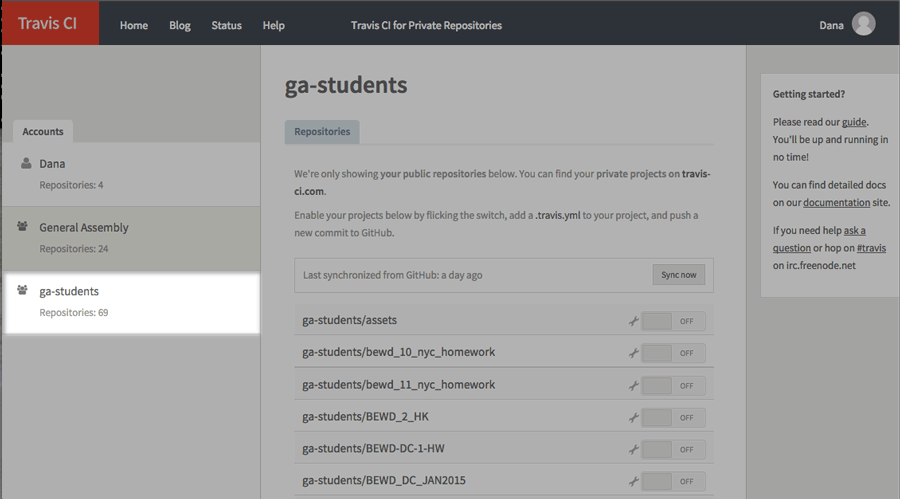
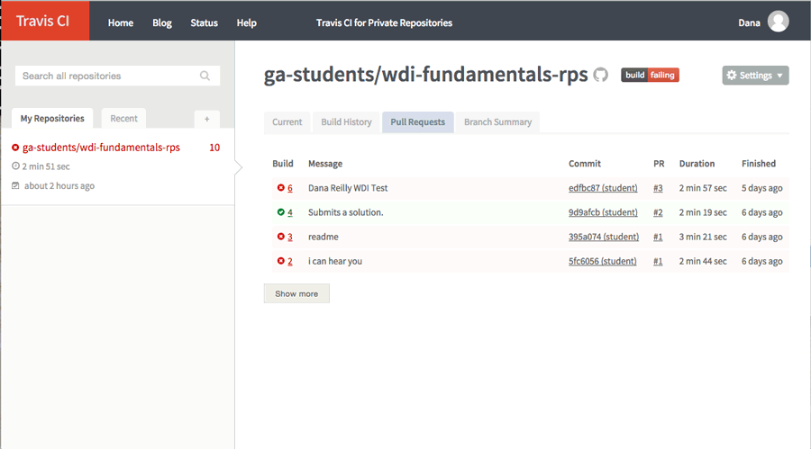

##WDI Fundamentals README for Instructors
 

To set our new WDI students up for success, we've created a pilot Gitbook, [WDI Fundamentals](fundamentals.generalassemb.ly) for students to complete before Day 1 of class.

To maximize the impact of this content, *please*:

###1) Go through WDI Fundamentals yourself.
This is an evolving product and we appreciate any and all feedback on its contents.

Please email Dana Reilly <dana@ga.co> or JD Maresco <jdm@ga.co> with your comments/questions/recommendations!

You can also provide anonymous feedback in this [QA spreadsheet](https://docs.google.com/a/generalassemb.ly/spreadsheets/d/1-u70IzOVfAS-J2aldRD9rTaCIfi5iR_IEVJYTa2azps/edit?usp=sharing).

###2) Track student progress.
You can view which students have completed the quiz at the end of each chapter (a good proxy for progress through the book) [here](https://docs.google.com/a/generalassemb.ly/spreadsheets/d/1P3ky0DRdo96aOWwbH2ZvlLVl6r8PM8TTMStKAPQ3Bmk/edit?usp=sharing).

This student-tracker spreadsheet also contains the students' score on each quiz.

We are definitely exploring ways to set up a dashboard, to automate a lot of this data collection.

###3) Grade Student projects.
Ok, this sounds more time-intensive than it is.  All students are required to submit a final cumulative project –a RockPaperScissors.js file, containing a functioning JavaScript app.

Please review student projects (submitted via pull request to [this repo](https://github.com/ga-students/wdi-fundamentals-rps).

Let us know in the student-tracker spreadsheet whether your students' JavaScript app:

|Points | Grade | Description|
| -------------------|
|2 | Exceeds Expectations | Code is human readable valid JS with absolutely no errors.
|1 | Meets Expectations| Code is human readable valid JS for the most part, with a few minor errors
|0 | Does Not Meet Expectations | Code is not human readable nor valid JS with 5 major errors or more.

####Automatic testing with Travis CI

We've set up autmatic testing using Travis CI, and so if you would prefer to review student code in this way:

* First, sign in to [travis-ci.org](travis-ci.org) using your Github account information.
	 
	
	 
	Travis CI will automatically sync with all of your repositories including those of the organizations you belong to.

* You'll want to find the `ga-students` repo called `wdi-fundamentals-rps` which is accessible [here](https://travis-ci.org/ga-students/wdi-fundamentals-rps).
	 
	
	 
* Click the "Pull Requests" tab to view the pull requests for this repo, in addition to an assessment of whether the project build failed or passed.
 	 
 	
	 

* Look for your students (their name and WDI cohort should be in their commit message).
	 
	
	 
	

